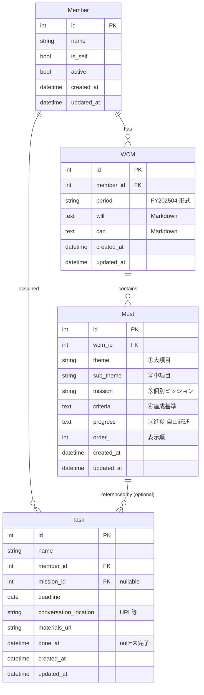

# データモデル

## ER 図



## テーブル定義

### `members`

| カラム | 型 | 制約 | 説明 |
|---|---|---|---|
| id | INTEGER | PK | |
| name | VARCHAR(100) | NOT NULL | メンバー名 |
| is_self | BOOLEAN | NOT NULL, default false | 本人フラグ |
| active | BOOLEAN | NOT NULL, default true | 在籍フラグ（false=異動・退職） |
| created_at | DATETIME | NOT NULL | |
| updated_at | DATETIME | NOT NULL | |

- 制約: `is_self = true` は最大 1 件（アプリ側 or UNIQUE 部分インデックス）

### `wcms`

| カラム | 型 | 制約 | 説明 |
|---|---|---|---|
| id | INTEGER | PK | |
| member_id | INTEGER | FK → members.id, NOT NULL | |
| period | VARCHAR(10) | NOT NULL | `FY202504` 形式 |
| will | TEXT | | Markdown 可 |
| can | TEXT | | Markdown 可 |
| created_at | DATETIME | NOT NULL | |
| updated_at | DATETIME | NOT NULL | |

- UNIQUE: `(member_id, period)`
- 過去期の read-only 判定はアプリ側で「現行期 period != 対象 period」で判断
  （DB に `archived` フラグは持たせない。現行期の切替はアプリ設定 or 計算で決定）

### `musts`

| カラム | 型 | 制約 | 説明 |
|---|---|---|---|
| id | INTEGER | PK | |
| wcm_id | INTEGER | FK → wcms.id, NOT NULL, ON DELETE CASCADE | |
| theme | VARCHAR(200) | NOT NULL | ①大項目 |
| sub_theme | VARCHAR(200) | | ②中項目（空可） |
| mission | VARCHAR(300) | NOT NULL | ③個別ミッション |
| criteria | TEXT | | ④達成基準 |
| progress | TEXT | | ⑤進捗 |
| order_ | INTEGER | NOT NULL, default 0 | 表示順 |
| created_at | DATETIME | NOT NULL | |
| updated_at | DATETIME | NOT NULL | |

- INDEX: `(wcm_id, order_)`

### `tasks`

| カラム | 型 | 制約 | 説明 |
|---|---|---|---|
| id | INTEGER | PK | |
| name | VARCHAR(300) | NOT NULL | |
| member_id | INTEGER | FK → members.id, NOT NULL | |
| mission_id | INTEGER | FK → musts.id, NULLABLE | 未紐づけ可 |
| deadline | DATE | NOT NULL | |
| conversation_location | VARCHAR(1000) | | Teams/Slack 等の URL |
| materials_url | VARCHAR(1000) | | 資料 URL |
| done_at | DATETIME | NULLABLE | null=未完了 |
| created_at | DATETIME | NOT NULL | |
| updated_at | DATETIME | NOT NULL | |

- INDEX: `(done_at, deadline)` — ダッシュボードの期限絞り込み用
- INDEX: `(member_id)`
- `mission_id` は ON DELETE SET NULL（Must 削除時にタスクは残す）

## 現行期（current period）の扱い

- DB にフラグを持たせず、アプリ設定 or 現在日から計算で決定。
- 計算例（会社の半期が 4 月 / 10 月開始の場合）:
  - 4–9 月 → `FY{YYYY}04`
  - 10–3 月 → `FY{YYYY}10`（1–3 月は `YYYY = 今年-1`）
- UI では期を明示的に切替可能にし、「現行期のみ編集可」とする。

## 主要クエリ（ダッシュボード）

```sql
-- 期限超過（未完了 かつ deadline < 今日）
SELECT * FROM tasks
WHERE done_at IS NULL AND deadline < :today
ORDER BY deadline ASC;

-- 期限近接（未完了 かつ 今日 <= deadline <= 今日+7日）
SELECT * FROM tasks
WHERE done_at IS NULL
  AND deadline BETWEEN :today AND :today_plus_7
ORDER BY deadline ASC;
```

## Enum

現時点では明示的な Enum は不要。
将来 `Task.status` を追加する場合は `.claude/rules/database.md` に従い `EnumColumn` (TypeDecorator) を使う。
