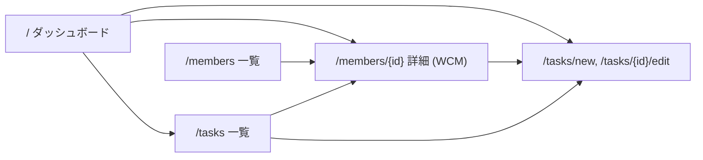

# 画面仕様

## 画面遷移図

全ページ共通でヘッダにナビゲーション（Dashboard / Members / Tasks）を配置。

---

## 1. `/` ダッシュボード

**目的**: 今すぐ着手すべきタスクを一目で把握。

### セクション構成（上から順）

1. **期限超過タスク**（強調表示 / 赤系）
   - 条件: `done_at IS NULL AND deadline < today`
   - 並び: `deadline` 昇順
2. **期限近接タスク（7日以内）**
   - 条件: `done_at IS NULL AND today <= deadline <= today+7`
   - 並び: `deadline` 昇順

### 各行の表示項目

| 項目 | 備考 |
|---|---|
| deadline | 「2026-04-20（あと3日）」など相対表示併記 |
| task name | クリックで編集画面 |
| member name | クリックでメンバー詳細 |
| mission | 紐づけがあれば ③ を表示、なければ「未紐づけ」 |
| conversation_location | リンクアイコン（別タブ） |
| materials_url | リンクアイコン（別タブ） |
| 完了ボタン | htmx で 1 クリック完了、行がフェードアウト |

### 空状態
- 両セクション共に該当なし → 「期限が近いタスクはありません」メッセージ

---

## 2. `/members` メンバー一覧

**目的**: 管理対象メンバーの一覧・追加・詳細への遷移。

### 表示
- テーブル: name / is_self / active / 操作
- デフォルト: `active=true` のみ
- トグル: 「退職・異動者も表示」ON で全件
- 本人行は視覚的に強調（ピン留めアイコン等）

### 操作
- 「新規追加」ボタン → モーダル or 別画面
- 行クリック → `/members/{id}`
- 編集 / 無効化ボタン

---

## 3. `/members/{id}` メンバー詳細（WCM）

**目的**: メンバーの WCM 閲覧・編集、過去期の参照。

### ヘッダ
- メンバー名、`is_self` バッジ
- **期セレクタ**: `FY202604 (現行)` / `FY202510` / `FY202504` ...
  - 該当メンバーに存在する period の降順
  - 現行期が無ければ「現行期を作成」ボタン

### Will / Can
- 現行期: テキストエリア（Markdown）/ 保存ボタン
- 過去期: read-only（Markdown レンダリング表示）

### Must テーブル

| # | ① theme | ② sub_theme | ③ mission | ④ criteria | ⑤ progress | 操作 |
|---|---|---|---|---|---|---|
| 1 | ... | ... | ... | ... | ... | 編集 / 削除 / ↑↓ |

- 現行期: 行追加・編集・削除・並び替え可能
- 過去期: read-only
- 各行から「このミッションにタスク追加」→ `/tasks/new?mission_id={id}` へ遷移

### 下部
- このメンバーに紐づくタスク一覧（未完了のみ、完了含むトグル）

---

## 4. `/tasks` タスク一覧

**目的**: 全タスクを俯瞰・検索。

### フィルタ
- メンバー（セレクト、複数選択可）
- 完了含む / 除く トグル（デフォルト: 除く）
- 期限範囲（任意）

### 表示列
- deadline / name / member / mission / done_at / 操作

### 並び順
- デフォルト: `done_at ASC NULLS FIRST, deadline ASC`
  （未完了を上に、期限が早い順）

### 操作
- 「新規追加」→ `/tasks/new`
- 行クリック → 編集画面
- 完了トグル（htmx で即時反映）

---

## 5. `/tasks/new`, `/tasks/{id}/edit`

**目的**: タスク登録・編集。

### フォーム項目

| 項目 | 型 | 必須 | 備考 |
|---|---|---|---|
| name | text | ✓ | |
| member_id | select | ✓ | `active=true` のメンバーのみ |
| mission_id | select | – | member 選択後に該当メンバーの**現行期** Must から絞り込み（htmx で動的更新） |
| deadline | date | ✓ | |
| conversation_location | url | – | Teams/Slack 等 |
| materials_url | url | – | |
| done_at | datetime | – | 編集画面のみ、完了切替ボタンで更新 |

### 挙動
- member を変更すると `mission_id` のセレクトが htmx で更新される
- URL クエリ `?mission_id=xxx` 付きで遷移した場合、member と mission を初期選択
- 保存後は `/tasks` または遷移元に戻る

---

## 共通 UX

- PicoCSS v2 のデフォルトを活かし、最低限のカスタム CSS
- インラインスタイル不使用（`.claude/rules/frontend.md`）
- htmx: 部分テンプレートと完全ページをリクエストヘッダで切替
- エラー時はフォーム上部にメッセージ表示、該当フィールドをハイライト
- 削除は確認ダイアログ必須
